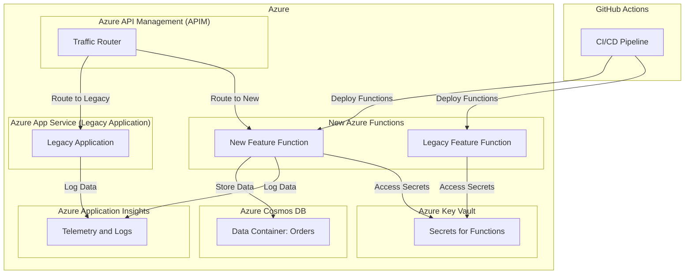

# Azure Strangler Fig Pattern Implementation

This repository demonstrates how to implement the **Strangler Fig Pattern** using Azure services such as Azure App Service, Azure Functions, Azure Cosmos DB, and Azure API Management. The project includes Bicep templates for infrastructure deployment, Python code for the legacy monolithic application and new microservices, and GitHub Actions workflows for continuous integration and deployment.

## 🏗️ Architecture Overview

## 📂 Folder Structure

- **`/infrastructure`**: Contains the Bicep template for deploying Azure resources and the GitHub Action for automating the deployment.
- **`/legacy-app-service`**: Contains the Python code for the legacy monolithic application and a GitHub Action to deploy it to Azure App Service.
- **`/new-feature-function`**: Contains the Python code for the new Azure Function that replaces part of the legacy functionality and a GitHub Action to deploy it.

## 📝 Explanation of the Strangler Fig Pattern

The **Strangler Fig Pattern** is a migration strategy that allows you to gradually replace parts of a legacy system with new microservices or components. Instead of a risky, large-scale migration, you "strangle" the old system incrementally by routing specific functionality to new services. This pattern reduces risk, allows continuous operation, and supports incremental improvements.

## 🛠️ How to Start

### Prerequisites

1. **Azure Subscription**: An active Azure account.
2. **Azure CLI**: Installed and configured.
3. **GitHub Repository**: Clone this repository to your local machine.

### Steps to Deploy

1. **Deploy Infrastructure**:
   - Navigate to the `/infrastructure` folder.
   - Run the GitHub Action to deploy the Bicep template.

2. **Deploy the Legacy Application**:
   - Navigate to the `/legacy-app-service` folder.
   - Run the GitHub Action to deploy the Python app to Azure App Service.

3. **Deploy the New Feature Function**:
   - Navigate to the `/new-feature-function` folder.
   - Run the GitHub Action to deploy the new Azure Function.

## 📄 License

This project is licensed under the MIT License - see the [LICENSE](LICENSE) file for details.
